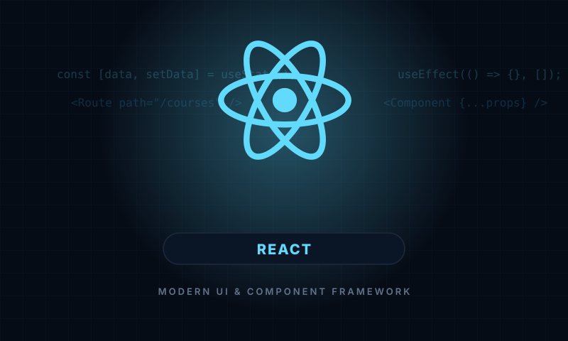
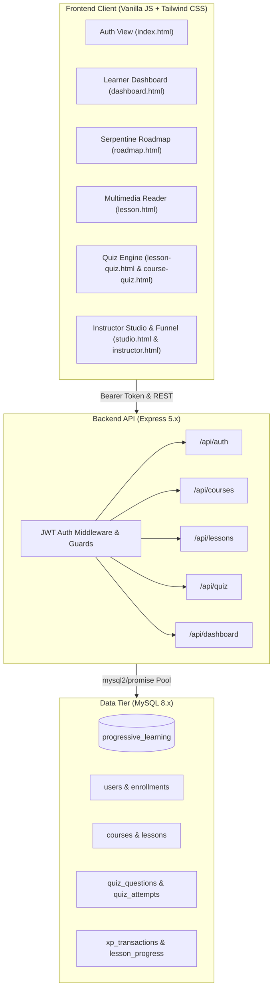

<div align="center">

  

  # Progressive Learning Platform
  
  **A Gamified LMS with Sequential Progression, Dynamic Assessments, and an XP Economy**

  [](https://nodejs.org/)
  [](https://expressjs.com/)
  [](https://www.mysql.com/)
  [](LICENSE)

  <p align="center">
    <a href="#-key-features">Key Features</a> •
    <a href="#-system-architecture">Architecture</a> •
    <a href="#-quick-start">Quick Start</a> •
    <a href="#-default-credentials">Demo Accounts</a> •
    <a href="#-api-documentation">API Reference</a> •
    <a href="#-database-schema">Database</a>
  </p>

</div>

---

## 📖 Overview

**Progressive Learning** is a modern, gamified learning platform built on Node.js, Express 5, and MySQL. Unlike standard video platforms where learners can passively skip content, Progressive Learning enforces **mastery-based sequential unlocking**: learners must demonstrate understanding through randomized quiz assessments before advancing to subsequent modules and unlocking the final certification exam.

The platform combines a warm, playful modern design system with a full **XP Economy**, **dynamic leveling**, **daily activity streaks**, a **winding serpentine roadmap trail**, and a rich **Instructor Hub** equipped with drop-off funnel analytics and a 3-mode visual Content Studio.

---

## ✨ Key Features

### 🎓 For Students & Learners
- **Sequential Lesson Unlocking**: Lessons unlock in strict order. Module $N$ is only accessible after passing Module $N-1$'s quiz assessment.
- **Winding Serpentine Learning Trail**: Khan Academy & Duolingo style interactive S-curve roadmap with animated dynamic SVG cubic bezier paths, pulsating halos on the active lesson, and flowing marching dashes.
- **Randomized Question Pools**: Quizzes select random subsets from a larger pool each attempt, preventing rote memorization and ensuring genuine retention.
- **Dynamic XP & Tier Progression**:
  - Earn **10 XP** per correct question on passing quizzes.
  - Earn **+100 XP** Course Completion Bonus upon passing the final exam.
  - 4 Dynamic Rank Tiers: **Beginner** (0–199 XP) $\rightarrow$ **Intermediate** (200–499 XP) $\rightarrow$ **Advanced** (500–999 XP) $\rightarrow$ **Expert** (1000+ XP).
- **Daily Streak Tracking**: Evaluates login frequency daily, rewarding consistent learners with a flame badge and encouraging habit formation.
- **Harmonious Navbar Badges**: Curated triadic gamification cluster in the header: **Warm Golden Honey XP** (`⚡`), **Coral Rose Streak** (`🔥`), and **Iris Indigo Rank** (`🎖️`) with matching icons and height.
- **Multimedia Lesson Viewer**: Clean markdown-ready reader supporting responsive YouTube video embeds, reading duration, key takeaways callouts, and clean quiz transitions.
- **Course Final Examination**: Capstone assessment node at the end of the roadmap, unlocking certificate XP and graduation state.
- **Dark & Light Mode**: Seamless theme switching with system auto-detection and persistent storage.

### 👨‍🏫 For Instructors & Administrators
- **Executive Analytics Dashboard**: Real-time KPI cards tracking total students, active enrollments, course completion rates, and average quiz scores.
- **Curriculum Drop-off Funnel**: Visual per-lesson completion bars identifying where students struggle or drop out.
- **3-Mode Content Studio**:
  - **Visual Form Mode**: Non-technical instructors build structured lessons using clean fields (Introduction, Concepts, Code Samples, Key Takeaways, Links).
  - **Live Preview Mode**: Real-time WYSIWYG rendering of video embeds, formatted typography, and prose.
  - **Raw HTML Mode**: Power-user code editor with direct syntax access for advanced custom styling and interactive embeds.
- **Course Lifecycle Management**: Create, edit, set XP unlock costs, and toggle **Draft** vs. **Published** status with a single click.
- **Quiz Question Bank**: Create and manage question pools for both lesson quizzes and final exams with single-click correct answer assignment.
- **Invite Code Security**: Protected instructor onboarding via server-verified invite codes (`INSTRUCTOR_INVITE_CODE`).

---

## 🏗️ System Architecture



---

## 🚀 Quick Start

### Prerequisites
- [Node.js](https://nodejs.org/) (v18.0.0 or higher recommended)
- [MySQL](https://www.mysql.com/) server (v8.0+ or MariaDB 10.4+)
- npm or yarn

### 1. Clone the Repository
```bash
git clone https://github.com/miradnaan/progressive-learning.git
cd progressive-learning
```

### 2. Install Dependencies
```bash
npm install
```

### 3. Configure Environment Variables
Copy the sample environment file and configure your database and JWT secrets:
```bash
cp .env.example .env
```

Edit `.env` with your preferred settings:
```env
DB_HOST=127.0.0.1
DB_USER=root
DB_PASS=your_mysql_password
DB_NAME=progressive_learning
DB_PORT=3306

PORT=3000
JWT_SECRET=super_secure_random_jwt_secret_key_change_in_production
INSTRUCTOR_INVITE_CODE=PLInstructor2024!SecureKey
```

### 4. Initialize Database & Seed Content
Run the automated schema creator and database seeder:
```bash
npm run init-db
```
*This creates the `progressive_learning` database, initializes 8 tables, seeds 4 comprehensive courses, 10 lessons, and 60+ quiz questions.*

### 5. Start the Application
```bash
# Production mode
npm start

# Development mode (with live watch)
npm run dev
```

Visit **`http://localhost:3000`** in your browser.

---

## 🔑 Default Credentials

For quick testing and grading, the database seeder comes pre-configured with two ready-to-use accounts:

| Role | Email | Password | Pre-loaded Data |
| :--- | :--- | :--- | :--- |
| **Student** | `alex@example.com` | `password123` | Enrolled in *HTML & CSS Fundamentals*, 240 XP, 5-day streak |
| **Instructor** | `instructor@example.com` | `password123` | Access to Content Studio, draft courses, and analytics |

> [!TIP]
> To reset a student's progress and test sequential unlocking from scratch:
> ```bash
> npm run reset-progress alex@example.com
> ```

---

## 📡 API Documentation

### Authentication (`/api/auth`)
| Method | Endpoint | Access | Description |
| :--- | :--- | :--- | :--- |
| `POST` | `/api/auth/register` | Public | Register student or instructor (requires invite code) |
| `POST` | `/api/auth/login` | Public | Authenticate user, update daily streak, return JWT |
| `GET` | `/api/auth/me` | Authenticated | Retrieve authenticated user profile & balance |
| `PUT` | `/api/auth/profile` | Authenticated | Update name, avatar URL, or change password |

### Courses & Catalog (`/api/courses`)
| Method | Endpoint | Access | Description |
| :--- | :--- | :--- | :--- |
| `GET` | `/api/courses` | Optional Auth | List published courses and user enrollment status |
| `GET` | `/api/courses/:id` | Optional Auth | Course details with lesson outline and enrollment check |
| `POST` | `/api/courses/:id/enroll` | Authenticated | Enroll in course (atomically deducts XP cost) |
| `GET` | `/api/courses/instructor/all` | Instructor | List all courses including drafts with student counts |
| `POST` | `/api/courses` | Instructor | Create new course |
| `PUT` | `/api/courses/:id` | Instructor | Update course title, category, duration, XP cost |
| `PATCH` | `/api/courses/:id/toggle-publish` | Instructor | Toggle course between Draft and Published |
| `DELETE` | `/api/courses/:id` | Instructor | Delete course and cascade dependent lessons |

### Lessons & Roadmap (`/api/lessons`)
| Method | Endpoint | Access | Description |
| :--- | :--- | :--- | :--- |
| `GET` | `/api/lessons/course/:courseId` | Authenticated | Fetch roadmap with dynamic `unlocked`/`locked` flags |
| `GET` | `/api/lessons/:id` | Authenticated | Fetch lesson reader content (enforces unlock gate) |
| `POST` | `/api/lessons` | Instructor | Create lesson in a course |
| `PUT` | `/api/lessons/:id` | Instructor | Update lesson content, video URL, position |
| `DELETE` | `/api/lessons/:id` | Instructor | Delete lesson and update course counts |

### Quizzes & Exams (`/api/quiz`)
| Method | Endpoint | Access | Description |
| :--- | :--- | :--- | :--- |
| `GET` | `/api/quiz/lesson/:lessonId` | Authenticated | Fetch 4 random questions for lesson quiz |
| `POST` | `/api/quiz/lesson/:lessonId/submit`| Authenticated | Submit answers; unlock next lesson & award XP |
| `GET` | `/api/quiz/course/:courseId` | Authenticated | Fetch 5 final exam questions (requires all lessons passed) |
| `POST` | `/api/quiz/course/:courseId/submit`| Authenticated | Submit final exam; marks course completed (+100 XP) |
| `GET` | `/api/quiz/admin/questions` | Instructor | View complete question bank with correct answers |
| `POST` | `/api/quiz/questions` | Instructor | Add new question to pool |
| `PUT` | `/api/quiz/questions/:id` | Instructor | Update question text, options, or correct answer |
| `DELETE` | `/api/quiz/questions/:id` | Instructor | Remove question from pool |

### Dashboard & Analytics (`/api/dashboard`)
| Method | Endpoint | Access | Description |
| :--- | :--- | :--- | :--- |
| `GET` | `/api/dashboard` | Student | Weekly activity chart, rank status, enrolled course progress |
| `GET` | `/api/dashboard/instructor` | Instructor | System metrics, course completion rates, drop-off funnel |

---

## 🗄️ Database Schema

The database design uses referential integrity with foreign key cascades:

```
┌──────────────────┐       ┌──────────────────┐       ┌──────────────────┐
│      users       │       │     courses      │       │     lessons      │
├──────────────────┤       ├──────────────────┤       ├──────────────────┤
│ id (PK)          │◄──┐   │ id (PK)          │◄──┐   │ id (PK)          │
│ name             │   │   │ title            │   │   │ course_id (FK)───┘
│ email (UNIQUE)   │   │   │ description      │   └───│ position         │
│ password_hash    │   │   │ category         │       │ title            │
│ role             │   │   │ duration         │       │ duration_minutes │
│ avatar_url       │   │   │ xp_cost          │       │ video_url        │
│ xp               │   │   │ published        │       │ content (LONGTEXT│
│ streak           │   │   └──────────────────┘       └──────────────────┘
│ last_active      │   │            ▲                          ▲
└──────────────────┘   │            │                          │
         ▲             │            │                          │
         │             │   ┌────────┴─────────┐       ┌────────┴─────────┐
         │             └───│   enrollments    │       │ quiz_questions   │
         │                 ├──────────────────┤       ├──────────────────┤
         │                 │ user_id (FK)     │       │ id (PK)          │
         │                 │ course_id (FK)   │       │ course_id (FK)   │
         │                 │ is_completed     │       │ lesson_id (FK)   │
         │                 └──────────────────┘       │ quiz_type        │
         │                                            │ question_text    │
         │                                            │ options (JSON)   │
         │                                            │ correct_answer   │
         │                                            └──────────────────┘
         │
         ├─────────────────────────────────────────┬──────────────────────┐
         ▼                                         ▼                      ▼
┌──────────────────┐                      ┌──────────────────┐   ┌──────────────────┐
│ lesson_progress  │                      │  quiz_attempts   │   │ xp_transactions  │
├──────────────────┤                      ├──────────────────┤   ├──────────────────┤
│ user_id (FK)     │                      │ id (PK)          │   │ id (PK)          │
│ lesson_id (FK)   │                      │ user_id (FK)     │   │ user_id (FK)     │
│ passed_quiz      │                      │ lesson_id (FK)   │   │ amount           │
│ completed_at     │                      │ course_id (FK)   │   │ reason           │
└──────────────────┘                      │ score / total    │   │ created_at       │
                                          │ passed           │   └──────────────────┘
                                          │ created_at       │
                                          └──────────────────┘
```

---

## 📂 Project Structure

```
progressive-learning/
├── config/
│   └── db.js                      # MySQL connection pool & schema handler
├── database/
│   └── schema.sql                 # MySQL schema, table DDL, and sample seeds
├── middleware/
│   └── auth.js                    # JWT verification & role authorization guards
├── public/
│   ├── css/style.css              # Design tokens, animations, and dark mode rules
│   ├── js/
│   │   ├── api.js                 # Central fetch wrapper and toast notifications
│   │   └── navbar.js              # Live navigation, theme toggle, and XP sync
│   ├── images/courses/            # Course SVG icons
│   ├── index.html                 # Hero intro and slide-down auth portal
│   ├── dashboard.html             # Student dashboard & XP tier progress
│   ├── courses.html               # Course catalog with pill category filters
│   ├── roadmap.html               # Winding serpentine S-curve learning trail
│   ├── lesson.html                # Multimedia lesson reader with video embeds
│   ├── lesson-quiz.html           # Randomized lesson mastery quiz
│   ├── course-quiz.html           # Capstone course final examination
│   ├── profile.html               # User profile, statistics & credentials
│   ├── instructor.html            # Instructor telemetry & dropoff funnel
│   └── studio.html                # 3-mode visual lesson builder & curriculum studio
├── routes/
│   ├── auth.js                    # Auth endpoints & profile management
│   ├── courses.js                 # Course catalog, enrollment, and CRUD
│   ├── lessons.js                 # Lesson progression and sequential gatekeeper
│   ├── quiz.js                    # Assessment grading and question bank
│   └── dashboard.js               # Analytics and telemetry aggregation
├── scripts/
│   ├── init_db.js                 # Automated database initialization script
│   └── reset_progress.js          # User progress reset utility
├── .env.example                   # Environment configuration template
├── .gitignore                     # Git ignore rules
├── LICENSE                        # MIT License
├── package.json                   # Project metadata and dependencies
└── server.js                      # Express application entrypoint
```

---

## 🤝 Contributing

Contributions are welcomed! Feel free to fork the repository, open issues for suggestions or bugs, and submit Pull Requests.

---

## 📄 License

Distributed under the **MIT License**. See [`LICENSE`](LICENSE) for more information.

---

<div align="center">
  <sub>Developed by <a href="https://github.com/miradnaan">Mir Adnan</a></sub>
</div>
